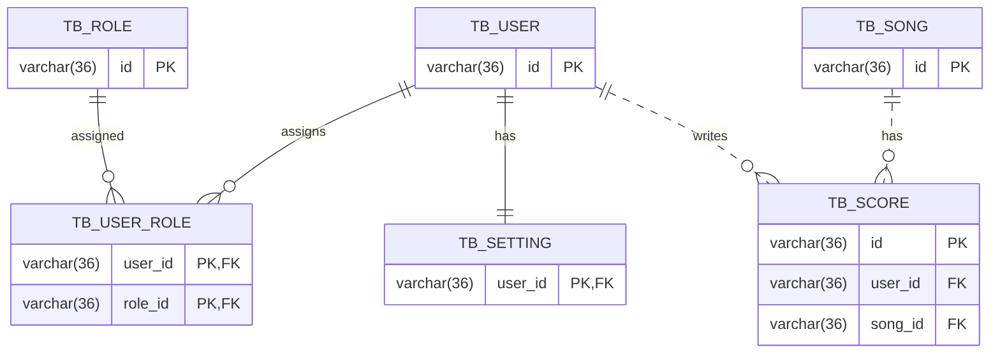

# 타자나라 API ERD

## Mermaid ER Diagram

## 관계 요약

### tb_user

- 0 .. n `tb_user_role`
- 0 .. 1 `tb_setting`

### tb_user_role

- 0 .. n `tb_user`
- 0 .. n `tb_role`

### tb_role

- 0 .. n `tb_user_role`

### tb_setting

- 1 .. 1 `tb_user`

### tb_song

- 0 .. n `tb_score`

### tb_score

- 0 .. n `tb_song`